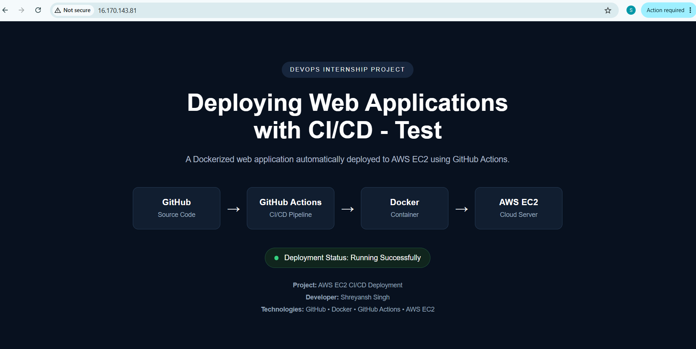
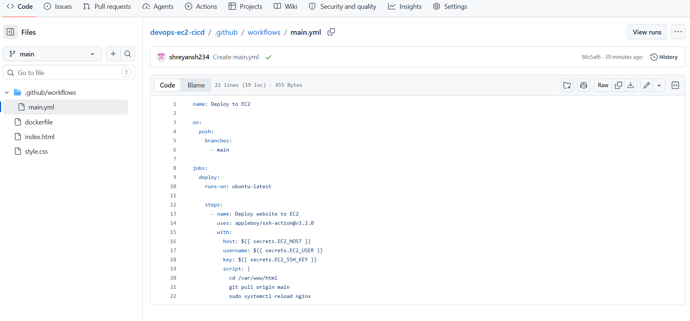
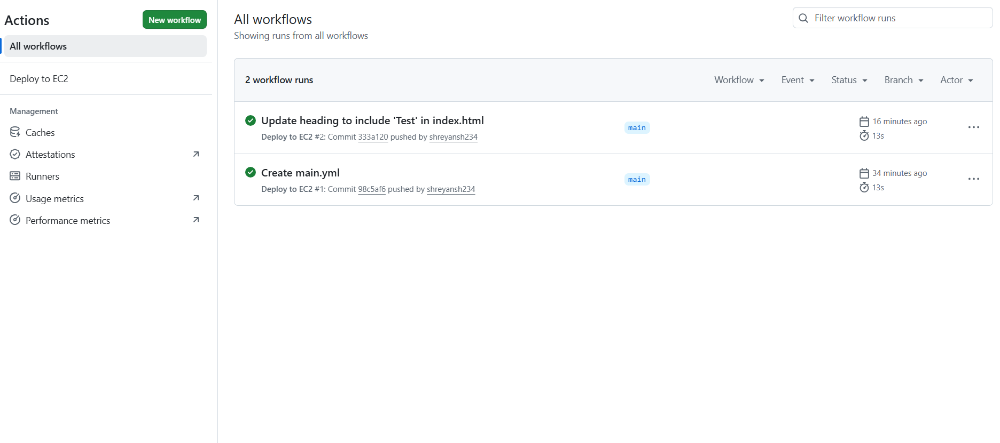
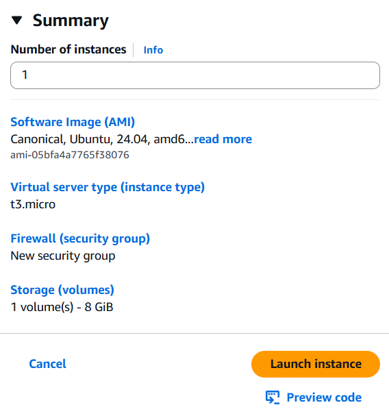
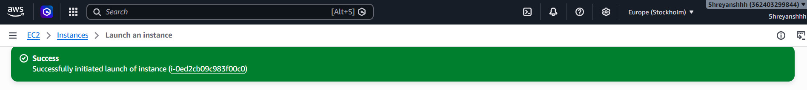
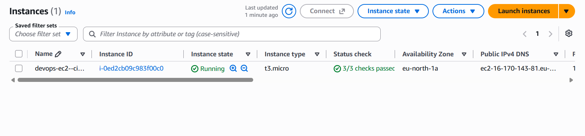
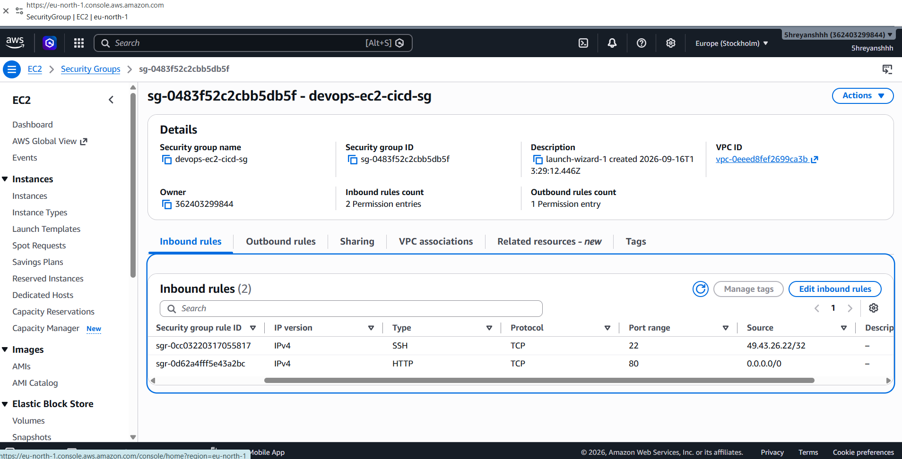

# DevOps EC2 CI/CD Deployment

A simple DevOps project that demonstrates how to automatically deploy a web application to an AWS EC2 instance using GitHub Actions.

This project uses AWS EC2, Nginx, GitHub Actions, Git, SSH, Docker, HTML, and CSS to demonstrate a basic CI/CD deployment workflow.

---

## Project Overview

The main goal of this project is to automatically deploy website changes from GitHub to an AWS EC2 server.

Whenever a new change is pushed to the `main` branch, GitHub Actions automatically starts the deployment workflow, connects to the EC2 instance through SSH, pulls the latest code, and reloads Nginx.

This removes the need to manually update the server every time the website code changes.

---

## Technologies Used

- AWS EC2
- Ubuntu Linux
- Nginx
- Git
- GitHub
- GitHub Actions
- SSH
- Docker
- HTML
- CSS

---

## Project Architecture

```text
Developer
   |
   | Push Code
   v
GitHub Repository
   |
   | Trigger Workflow
   v
GitHub Actions
   |
   | SSH Connection
   v
AWS EC2 Instance
   |
   | git pull
   | reload Nginx
   v
Live Website
```

---

## CI/CD Workflow

The CI/CD pipeline works in the following way:

1. Website code is stored in the GitHub repository.
2. A change is committed and pushed to the `main` branch.
3. GitHub Actions automatically starts the deployment workflow.
4. GitHub Actions connects to the EC2 instance using SSH.
5. The EC2 server pulls the latest code from GitHub.
6. Nginx is reloaded.
7. The updated website becomes available on the server.

---

## GitHub Actions Workflow

The workflow is stored at:

```text
.github/workflows/main.yml
```

It runs automatically whenever code is pushed to the `main` branch.

The deployment process performs:

```bash
cd /var/www/html
git pull origin main
sudo systemctl reload nginx
```

---

## GitHub Secrets

Sensitive EC2 information is stored securely using GitHub Secrets.

The workflow uses:

```text
EC2_HOST
EC2_USER
EC2_SSH_KEY
```

This helps avoid exposing server credentials directly in the repository.

---

## AWS EC2 Setup

An Ubuntu EC2 instance is used to host the website.

The server was configured with:

- Nginx web server
- Git
- SSH access
- Project repository
- HTTP access on port 80

The website files are deployed inside:

```text
/var/www/html
```

---

## Security Group Configuration

The EC2 Security Group allows:

```text
HTTP  - Port 80
SSH   - Port 22
```

HTTP access is used to serve the website.

SSH access is restricted for secure server administration.

---

## Project Files

```text
devops-ec2-cicd/
│
├── .github/
│   └── workflows/
│       └── main.yml
│
├── dockerfile
├── index.html
└── style.css
```

---

## Testing the CI/CD Pipeline

The deployment pipeline was tested by changing the website content in GitHub.

After committing the change:

```text
GitHub Commit
      ↓
GitHub Actions Triggered
      ↓
Workflow Completed Successfully
      ↓
EC2 Pulled Latest Code
      ↓
Website Updated Automatically
```

The deployment completed successfully without manually updating the EC2 server.

---

## Key Learnings

Through this project, I learned:

- How to launch and configure an AWS EC2 instance
- How to connect to EC2 using SSH
- How to configure Nginx
- How to use Git and GitHub
- How GitHub Actions works
- How to create a CI/CD deployment pipeline
- How to use GitHub Secrets
- Basic Linux server management
- Basic AWS Security Group configuration

---

## Repository

GitHub Repository:

https://github.com/shreyansh234/devops-ec2-cicd

---

## Author

**Shreyansh Singh**

GitHub:  
https://github.com/shreyansh234

LinkedIn:  
https://www.linkedin.com/in/shreyansh01122006

---

## Project Status

✅ AWS EC2 configured  
✅ Nginx configured  
✅ GitHub repository connected  
✅ GitHub Actions configured  
✅ CI/CD pipeline tested  
✅ Automatic deployment verified  

---

## Conclusion

This project demonstrates a simple CI/CD pipeline for automatically deploying a web application from GitHub to AWS EC2.

It helped me understand how cloud servers, GitHub Actions, SSH, Linux, and web servers work together in a real DevOps deployment process.


## 📘 Project Documentation

### 🚀 Live Deployment

The web application is successfully deployed and running on an AWS EC2 instance.



---

### ⚙️ CI/CD Pipeline

GitHub Actions is used to automate the deployment process. Whenever changes are pushed to the `main` branch, the workflow automatically connects to the AWS EC2 instance and deploys the latest version of the application.

#### GitHub Actions Workflow

The workflow file defines the automated deployment process from GitHub to AWS EC2.



#### Successful Workflow Execution

The successful GitHub Actions runs confirm that the CI/CD pipeline executed correctly.



---

### ☁️ AWS EC2 Configuration

The web application is hosted on an Ubuntu-based AWS EC2 instance.

#### EC2 Instance Configuration

This shows the configuration used while setting up the EC2 instance.



#### EC2 Instance Launch

The EC2 instance was successfully created and launched on AWS.



#### EC2 Instance Running

The EC2 instance is running successfully and all status checks have passed.



---

### 🔐 Security Configuration

The EC2 Security Group controls incoming network traffic. HTTP is used to make the website accessible, while SSH is used for server administration and deployment.



---

### 🔄 Deployment Flow

The complete CI/CD deployment process follows this flow:

`Code Change → GitHub → GitHub Actions → SSH → AWS EC2 → Nginx → Live Website`

Whenever a change is pushed to the `main` branch, GitHub Actions automatically starts the deployment workflow. The workflow connects to the EC2 server through SSH, pulls the latest code and reloads the web server.

This project demonstrates a working automated CI/CD deployment pipeline using GitHub Actions and AWS EC2.
